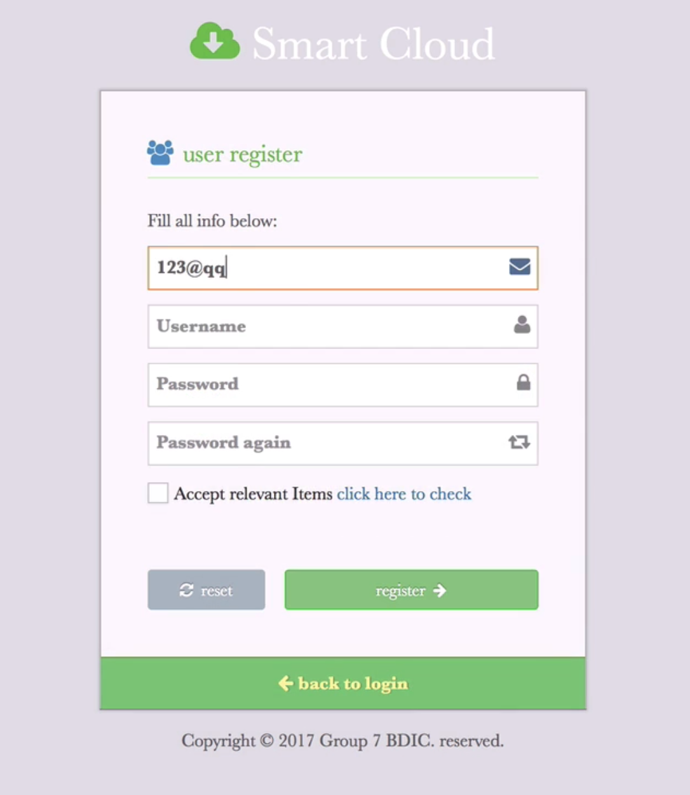
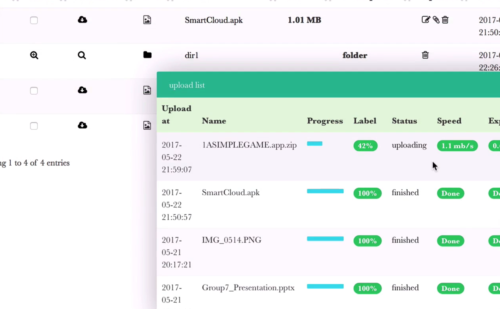
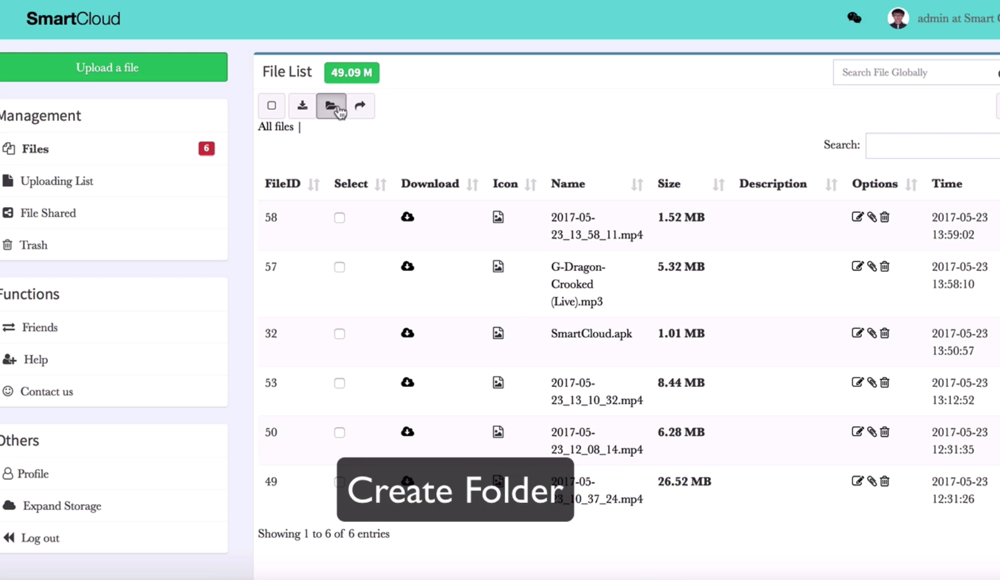
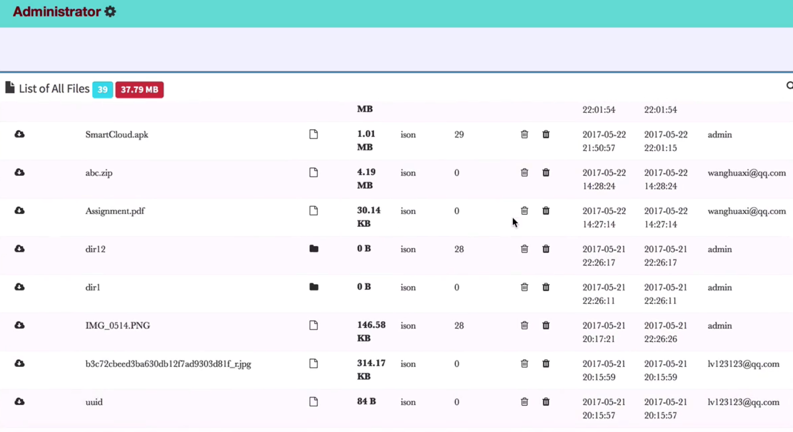
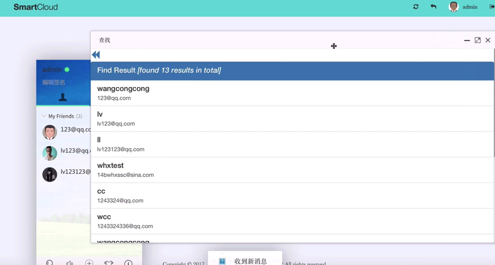

# Smart Cloud Storage supported by Laravel

This is a team project (stage 3 undergraduate), more information about the project goes to the 

[project_report file]: final_report.pdf	"project_report"

Some screenshots of the website side (my primary work part) goes as follows

